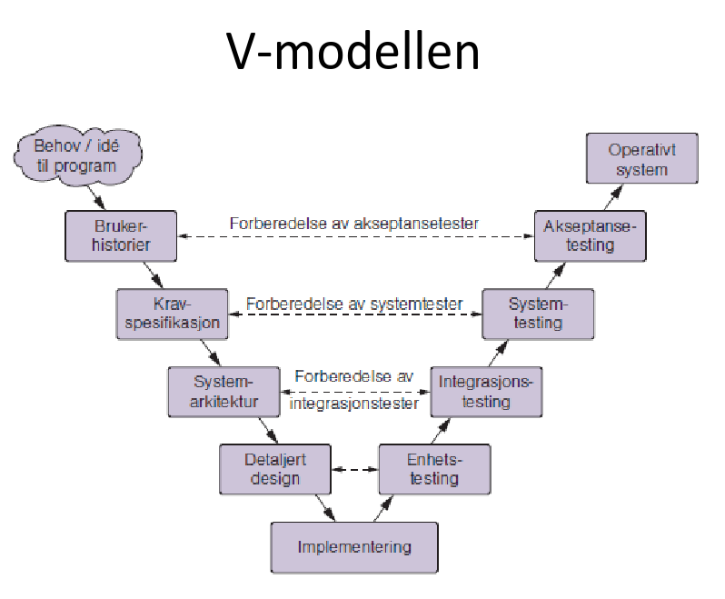

# Forelesning 24.10 - Testing
## 7 prinsipper
1. Testing kan ikke bevise at koden er feilfri
2. Fullstendig testing er umulig
3. Tidlig testing sparer tid og penger
4. Feil samler seg i klynger
5. Pass på sprøytemiddel-paradokset
6. Testing er avhengig av konteksten
7. Feilslutning vedrørende fravær av feil

## V-modellen

## Statisk vs dynamisk
Statisk testing er testing som ikke kjører koden. Ofte manuelle reviews av koden. Tidskrevende, men oppdager feil tidlig. Denne typen testing kan være uformell og billig.

Dynamisk testing tester at programmet fungerer i praksis. Det deles inn i white-box og black-box. I white box testing testes hver linje av koden av utvikleren som skriver den. Utvikler vet hvordan koden fungerer og setter opp tester etter forventet resultat. I black-box testing vet ikke utviklerne hvordan den underliggende koden fungerer, men tester heller funksjonelle og ikke-funksjonelle krav til systemet i sin helhet. Dynamisk testing kan ta mye tid ved store mengder tester.

Statisk testing gjøres for å forhindre feil og kan gi 100% verifikasjon.
Dynamisk testing gjøres for å finne feil etter deployment og gir ikke 100% sikkerhet.

## Termer
Testautomasjon: Tester automatiseres gjerne hvis de er enkle(enhetstester), men eksempelvis systemtester er vaskelige å automatisere.
Testuavhengighet: Ved høy uavhengighet kjenner ikke testeren til koden. Enhetstester er helt avhengige fordi de som skrev koden skriver testen.

## Hierarki over testing(ChatGPT):
### 1. Static Testing
Static testing checks artifacts **without executing code**.

#### 1.1. Reviews
Structured human examination of documents/code.

**1.1.1. Informal Reviews**
- Ad-hoc review  
- Buddy check  
- Pair programming review

**1.1.2. Walkthroughs**
- Author-led  
- Scenario-based walkthrough  
- Stakeholder walkthrough

**1.1.3. Technical Reviews**
- Peer review  
- Architecture review  
- Design review  
- Requirements review

**1.1.4. Inspections**
- Fagan inspection  
- Checklist-based inspection  
- Preparation + logging + defect meeting

---

#### 1.2. Static Analysis
Automated analysis of code or models.

**1.2.1. Code Quality Analysis**
- Linting  
- Style checking  
- Complexity metrics (cyclomatic complexity, Halstead metrics)

**1.2.2. Data Flow Analysis**
- Live variables  
- Reaching definitions  
- Uninitialized variables

**1.2.3. Control Flow Analysis**
- Control flow graphs  
- Dead code detection  
- Path analysis

**1.2.4. Security Static Analysis**
- SAST (Static Application Security Testing)  
- Vulnerability scanning  
- Hardcoded secrets detection

**1.2.5. Formal Methods**
- Specification validation  
- Model checking  
- Theorem proving  
- Static type checking (e.g., borrow checking)

---

### 2. Dynamic Testing
Dynamic testing checks software **by executing it**.

#### 2.1. Levels of Testing
Organized by scope.

**2.1.1. Unit Testing**
- Function tests  
- Class/module tests  
- Property-based testing

**2.1.2. Integration Testing**
- Interface testing  
- API testing  
- Contract testing  
- Component interaction testing

**2.1.3. System Testing**
- End-to-end testing  
- System integration  
- Full-stack testing

**2.1.4. Acceptance Testing**
- UAT (User Acceptance Testing)  
- Beta testing  
- Contract acceptance  
- Regulatory acceptance

---

#### 2.2. Types of Dynamic Testing
Grouped by approach.

**2.2.1. Functional Testing**
- Smoke testing  
- Sanity testing  
- Boundary value analysis
- Equivalence partitioning  
- Decision table testing  
- State transition testing  
- Use case–based testing  
- API functional tests

##### 2.2.2. Non-Functional Testing

**Performance**
- Load testing  
- Stress testing  
- Spike testing  
- Scalability testing  
- Soak/endurance testing  

**Security**
- DAST  
- Penetration testing  
- Fuzz testing  
- Authentication/authorization testing

**Usability**
- UX evaluation  
- Accessibility testing

**Reliability / Availability**
- Chaos engineering  
- Fault injection  
- Recovery testing

**Maintainability / Portability**
- Installation testing  
- Compatibility testing  
- Upgrade & migration tests

---

**2.2.3. White-Box (Structural) Testing**
- Statement coverage  
- Branch coverage
- Condition coverage
- MC/DC  
- Path coverage  
- Loop testing

**2.2.4. Black-Box Testing**
- Requirements-based testing  
- Domain testing  
- Input/output testing  
- Error guessing  
- Exploratory testing

**2.2.5. Grey-Box Testing**
- Session-based test management  
- Data-flow–focused black-box  
- Architectural-risk-based testing

---

#### 2.3. Test Automation

**2.3.1. Test Execution Frameworks**
- Unit test frameworks  
- BDD frameworks  
- Automated E2E tools

**2.3.2. Continuous Testing**
- CI pipeline tests  
- Deployment gate tests  
- Canary tests

**2.3.3. Test Data and Environment Automation**
- Test data generation  
- Environment provisioning  
- Containerized test environments

---

#### 2.4. Specialized Dynamic Testing Techniques

**2.4.1. Fuzzing**
- Coverage-guided fuzzing  
- Mutation-based fuzzing  
- Grammar-based fuzzing

**2.4.2. Runtime Verification**
- Invariant checking  
- Temporal logic monitoring  
- Observability tests

**2.4.3. Mutation Testing**
- Mutant generation  
- Kill score analysis  
- Test suite adequacy measurement