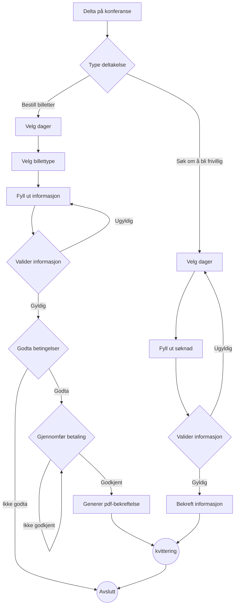

# Ukesoppgaver - uke 7
1. 

```mermaid
flowchart TD
	A[Delta på konferanse] --> B{Type deltakelse}
    B -->|Bestill billetter| C[Velg dager]
    B -->|Søk om å bli frivillig| D[Velg dager]
    D --> E[Fyll ut søknad]
    E --> F{Valider informasjon}
    F -->|Ugyldig| D
    F -->|Gyldig| G[Bekreft informasjon]
    C --> H[Velg billettype]
    H --> I[Fyll ut informasjon]
    I --> J{Valider informasjon}
    J -->|Ugyldig| I
    J -->|Gyldig| K{Godta betingelser}
    K -->|Ikke godta| L((Avslutt))
    K -->|Godta| M{Gjennomfør betaling}
    M -->|Ikke godkjent| M
    M -->|Godkjent| N[Generer pdf-bekreftelse]
    N --> Z
    G --> Z((kvittering))
    Z --> L
```
2. Eksternt diagram